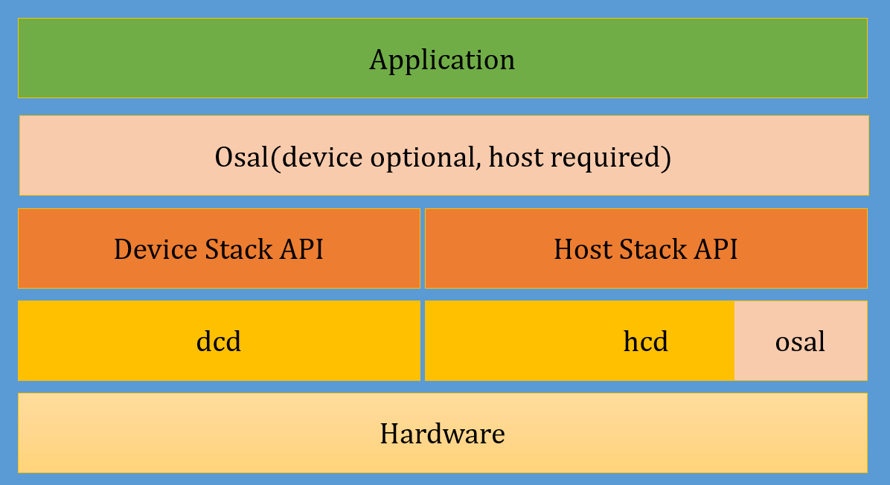

# CherryUSB

[English](./README.md)

CherryUSB 是一个小而美的、可移植性高的、用于嵌入式系统(带 USB ip)的 USB 主从协议栈。



## 为什么选择

- 比较全面的 class 驱动，并且 class 驱动全部模板化，方便学习和自主添加
- 树状化编程，方便理清 class 驱动与接口、端点的关系，hub、port、class 之间的关系；代码层层递进，调用关系一目了然，方便理清 usb 枚举过程和 class 驱动加载
- 设备协议栈使用等价于 uart tx/rx dma 的使用，主机协议栈的使用等价于文件的使用
- 标准化的 porting 接口，同时面向 ip 化编程，相同 ip 无需重复编写驱动
- Api 少，分类清晰：dcd/hcd api、注册 api、命令回调 api
- 协议栈代码精简，内存占用极小，ip 驱动代码也做到精简，能够达到 usb 硬件理论带宽

## 目录结构

```
.
├── class
├── common
├── core
├── demo
├── docs
├── osal
├── packet capture
└── port
└── tools
```

|   目录名       |  描述                          |
|:-------------:|:------------------------------:|
|class          |  usb class 类主从驱动           |
|common         |  usb spec 定义、常用宏、标准接口定义 |
|core           |  usb 主从协议栈核心实现            |
|demo           |  示例                          |
|docs           |  文档                          |
|osal           |  os 封装层                       |
|packet capture |  抓包文件（需要使用力科软件打开）|
|port           |  usb 主从需要实现的 porting 接口 |
|tools           |  工具链接                       |

## Device 协议栈简介

CherryUSB Device 协议栈对标准设备请求、CLASS 请求、VENDOR 请求以及 custom 特殊请求规范了一套统一的函数框架，采用面向对象和链表的方式，能够使得用户快速上手复合设备，不用管底层的逻辑。同时，规范了一套标准的 dcd porting 接口，用于适配不同的 USB IP，达到面向 ip 编程。

CherryUSB Device 协议栈当前实现以下功能：

- 支持 USB2.0 全速和高速设备
- 支持端点中断注册功能，porting 给用户自己处理中断里的数据
- 支持复合设备
- 支持 Communication Device Class (CDC)
- 支持 Human Interface Device (HID)
- 支持 Mass Storage Class (MSC)
- 支持 USB VIDEO CLASS (UVC1.0、UVC1.5)
- 支持 USB AUDIO CLASS (UAC1.0、UAC2.0)
- 支持 Device Firmware Upgrade CLASS (DFU)
- 支持 USB MIDI CLASS (MIDI)
- 支持 Test and Measurement CLASS (TMC)
- 支持 Remote NDIS (RNDIS)
- 支持 WINUSB1.0、WINUSB2.0(带 BOS )
- 支持 Vendor 类 class

CherryUSB Device 协议栈资源占用说明（GCC 10.2 with -O2）：

|   file      |  FLASH (Byte)  |  RAM (Byte)  |
|:-----------:|:--------------:|:------------:|
|usbd_core.c  |  3045          | 373          |
|usbd_cdc.c   |  302           | 20           |
|usbd_msc.c   |  2452          | 132          |
|usbd_hid.c   |  784           | 201          |
|usbd_audio.c |  438           | 14           |
|usbd_video.c |  402           | 4            |

## Host 协议栈简介

CherryUSB Host 协议栈对挂载在 roothub、外部 hub 上的设备规范了一套标准的枚举实现，对不同的 Class 类也规范了一套标准接口，用来指示在枚举后和断开连接后该 Class 驱动需要做的事情。同时，规范了一套标准的 hcd porting 接口，用于适配不同的 USB IP，达到面向 IP 编程。最后，协议栈使用 OS 管理，并提供了 osal 用来适配不同的 os。

CherryUSB Host 协议栈当前实现以下功能：

- 自动加载支持的Class 驱动
- 支持阻塞式传输和异步传输
- 支持复合设备
- 支持多级 HUB,最高可拓展到 7 级
- 支持 Communication Device Class (CDC)
- 支持 Human Interface Device (HID)
- 支持 Mass Storage Class (MSC)
- 支持 Remote NDIS (RNDIS)
- 支持 Vendor 类 class

同时，CherryUSB Host 协议栈还提供了 lsusb 的功能，借助 shell 插件可以查看所有挂载设备的信息，包括外部 hub 上的设备的信息。

CherryUSB Host 协议栈资源占用说明（GCC 10.2 with -O2）：

|   file        |  FLASH (Byte)  |  RAM (Byte)  |
|:-------------:|:--------------:|:------------:|
|usbh_core.c    |  7992          | 472          |
|usbh_cdc_acm.c |  1208          | 4            |
|usbh_msc.c     |  2239          | 4            |
|usbh_hid.c     |  930           | 4            |
|usbh_hub.c     |  3878          | 14           |

## 文档教程

CherryUSB 快速入门、USB 基本概念，API 手册，Class 基本概念和例程，参考 [CherryUSB 文档教程](https://cherryusb.readthedocs.io/)

## 视频教程

USB 基本知识点与 CherryUSB Device 协议栈是如何编写的，参考 [CherryUSB Device 协议栈教程](https://www.bilibili.com/video/BV1Ef4y1t73d).

## 图形化界面配置工具

[chryusb_configurator](https://github.com/Egahp/chryusb_configurator) 采用 **electron + vite2 + ts** 框架编写，当前用于自动化生成描述符数组，后续会增加其他功能。

## 示例仓库

注意：0.4.1 版本以后 dcd 驱动进行了重构，部分仓库不做长期维护，所以如果使用高版本需要自行更新

|   厂商               |  芯片或者系列      | USB IP| 仓库链接 |      对应 master 版本        |
|:--------------------:|:------------------:|:-----:|:--------:|:---------------------------:|
|Bouffalolab    |  BL702 | bouffalolab|[bl_mcu_sdk](https://github.com/bouffalolab/bl_mcu_sdk/tree/master/examples/usb)| latest |
|Essemi    |  ES32F36xx | musb |[es32f369_repo](https://github.com/sakumisu/CherryUSB/tree/master/demo/es32)|latest |
|AllwinnerTech    |  F1C100S | musb |[cherryusb_rtt_f1c100s](https://github.com/CherryUSB/cherryusb_rtt_f1c100s)|latest |
|ST    |  STM32F103C8T6 | fsdev |[stm32f103_repo](https://github.com/sakumisu/CherryUSB/tree/master/demo/stm32/usb_device/stm32f103c8t6)|latest |
|ST    |  STM32F4 | dwc2 |[stm32f429_device_repo](https://github.com/sakumisu/CherryUSB/tree/master/demo/stm32/usb_device/stm32f429igt6)   [stm32f429_host_repo](https://github.com/sakumisu/CherryUSB/tree/master/demo/stm32/usb_host/stm32f429igt6)|latest |
|ST    |  STM32H7 | dwc2 |[stm32h743_device_repo](https://github.com/sakumisu/CherryUSB/tree/master/demo/stm32/usb_device/stm32h743vbt6)   [stm32h743_host_repo](https://github.com/sakumisu/CherryUSB/tree/master/demo/stm32/usb_host/stm32h743xih6)|latest |
|HPMicro    |  HPM6750 | hpm/ehci |[hpm_repo](https://github.com/CherryUSB/cherryusb_hpmicro)|v0.5.2 |
|WCH    |  CH32V307 | ch32_usbfs/ch32_usbhs|[ch32v307_repo](https://github.com/CherryUSB/cherryusb_ch32v307)|latest |
|WCH    |  CH57x | ch58x |[ch57x_repo](https://github.com/CherryUSB/cherryusb_ch57x)|v0.4.1 |
|Nuvoton    |  Nuc442 | nuvoton |[nuc442_repo](https://github.com/CherryUSB/cherryusb_nuc442)|v0.4.1 |
|Geehy    |  APM32E10x APM32F0xx| fsdev |[apm32_repo](https://github.com/CherryUSB/cherryusb_apm32)|v0.4.1 |
|Nordicsemi |  Nrf52840 | nrf5x |[nrf5x_repo](https://github.com/CherryUSB/cherryusb_nrf5x)|v0.4.1 |
|Espressif    |  esp32 | dwc2 |[esp32_repo](https://github.com/CherryUSB/cherryusb_esp32)|v0.4.1 |
|Mindmotion    |  MM32L3xx | mm32 |[mm32_repo](https://github.com/CherryUSB/cherryusb_mm32)|v0.4.1 |

## Contact

QQ 群:642693751